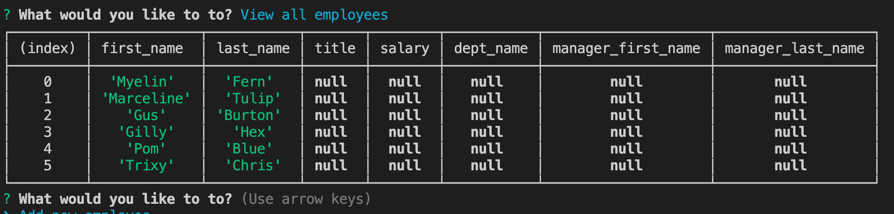
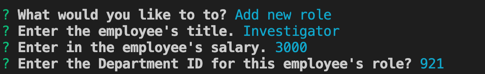
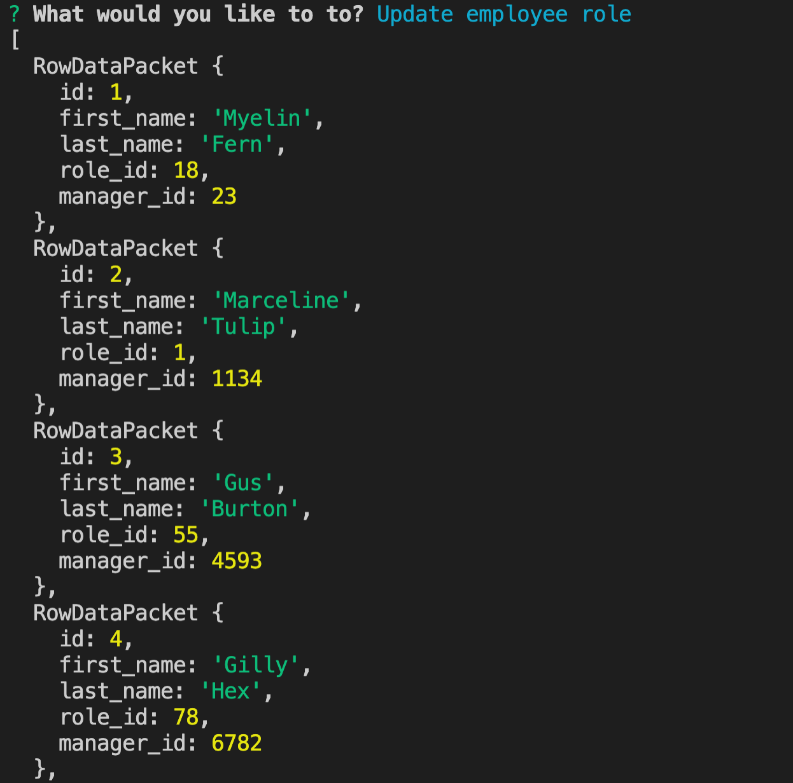
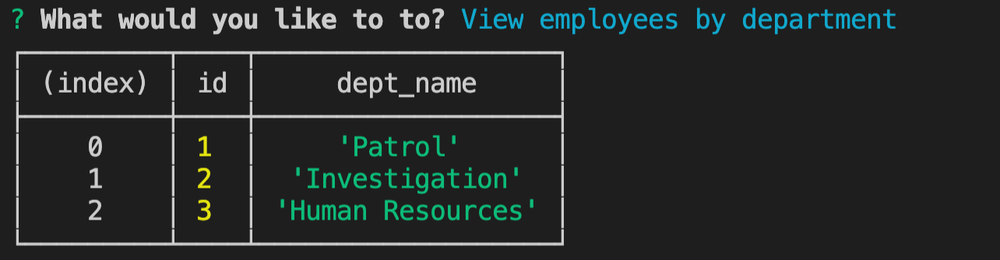

# Employee Tracker with MySQL 

  ## Table of Contents

  - [Description](#description)
  - [Installation](#installInstructions)
  - [Usage](#usageInfo)
  - [Contributions & Guidelines](#contributorGuidelines)
  - [Tests](#testInstructions)
  - [Questions](#questions)

  ## Description 

This Employee Tracker application will allow a user to construct an employee directory and allowing for modifications, additions, and deletions of `roles`, `salary`, `employee managers`, `departments` and `employee name`. Using inquirer the user will be prompted to through a series of questions to add, update, and remove from the employee directory. The user can make as many employee directory changes as preferred before selecting `exit` to close the application. After each modification the user will have their changes displayed in a data table. View a preview of the application in the images below. 

### Employee Tracker View All

### Employee Tracker Add Role

### Employee Tracker Update Role

### Employee Tracker View By Department 

  ## Installation 

   To install this express application clone code to a local repository.

  ## Usage 

   To use this MySQL and Inquirer application the user can must use a VSCode and use installed dependencies to launch the application. The user will also need to run the schema.sql file in MySQL to launch the database. To make this application's data their own, the user can delete existing employees through the application or attached schema.sql file. 

  ## Contributions & Guidelines 

   This application was created by developer: Christina Flores. 

  ## Tests 

N/A 

  ## Questions 

  [To reach me by email click here.](mailto:.com) 

  [Click for my Github profile.](https://github.com/) 

  ## Badges 

  
   

